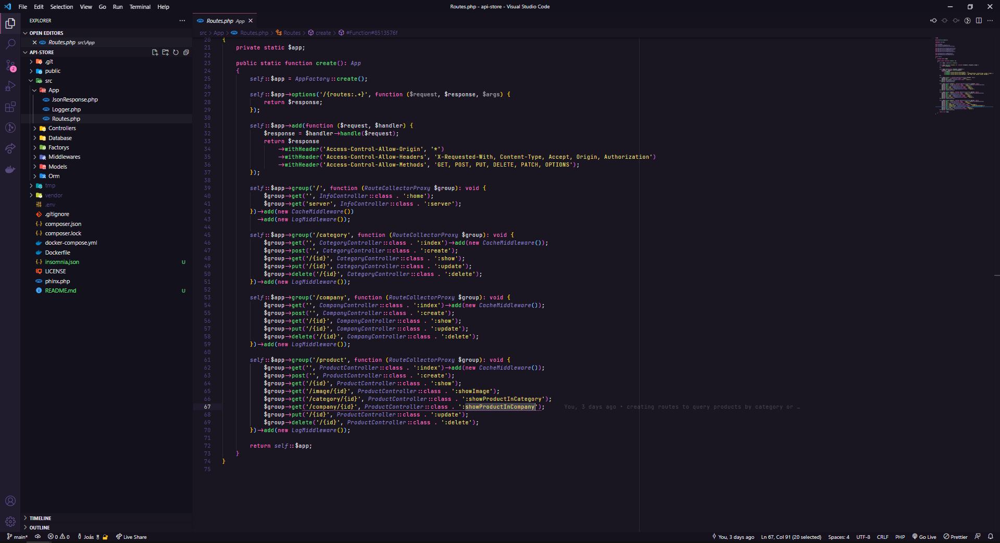

<h1 align="center">API-STORE</h1>

  <a href="#-tecnologias">Tecnologias</a>&nbsp;&nbsp;&nbsp;|&nbsp;&nbsp;&nbsp;
  <a href="#-projeto">Projeto</a>&nbsp;&nbsp;&nbsp;|&nbsp;&nbsp;&nbsp;
  <a href="#-diagrama">Diagrama</a>&nbsp;&nbsp;&nbsp;|&nbsp;&nbsp;&nbsp;
  <a href="#-como-executar">Como executar</a>&nbsp;&nbsp;&nbsp;|&nbsp;&nbsp;&nbsp;
  <a href="#-licença">Licença</a>

  

 

  

## ✨ Tecnologias

Esse projeto foi desenvolvido com as seguintes tecnologias:

- [PHP 8](https://www.php.net/)
- [Slim](https://www.slimframework.com/)
- [Phinx](https://phinx.org/)
- [Monolog](https://seldaek.github.io/monolog/)
- [Predis](https://github.com/predis/predis)

## 💻 Projeto

O Api-Store é uma aplicação que consiste em gerenciar um marketplace de empresas. Nela fazemos o gerenciamento de empresas, produtos, e categorias.

Esse projeto foi desenvolvido durante o hackathon da faculdade UniAlfa, com objetivo de obter conhecimento, aprendendo conceitos sobre o que é um API, como iniciar um projeto utilizando PHP e Slim para gerenciamento das rotas, Phinx para criação do banco de dados, logs de erros e requisição.

## 🚀 Como executar

- Clone o repositório
- Execute `docker-compose up --build -d`
- Em seguida `docker exec -it api bash`
- Instale as dependências com `composer install`
- Executando os scripts do banco `vendor/bin/phinx migrate -e development`

A aplicação pode ser acessada em [`localhost:8080`](http://localhost:8080).

## 📄 Licença

Esse projeto está sob a licença MIT. Veja o arquivo [LICENSE](LICENSE) para mais detalhes.

---